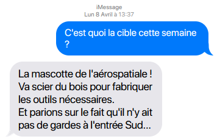
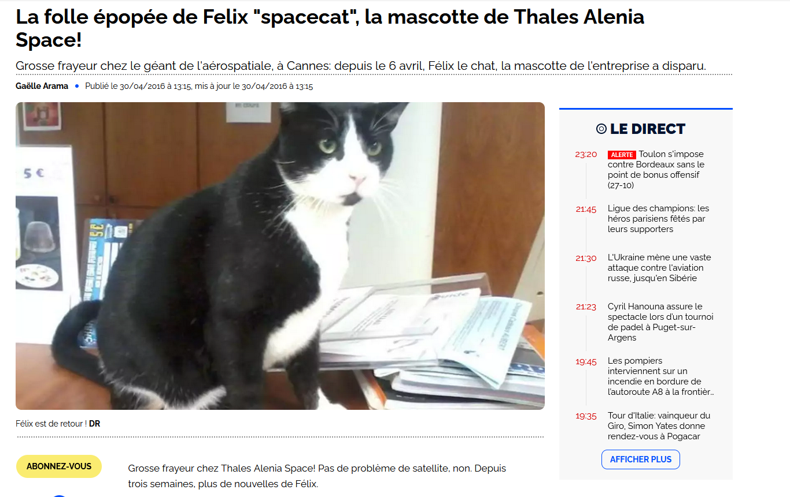

# Earth Attack (1/2)
hard
Auteur : Sherpearce

Une conversation entre deux individus suspects a été interceptée. Ils font du repérage sur des usines d'aéronautique depuis des semaines et semblent malintentionnés. Saurez-vous trouver la première entreprise ciblée ?

Format du flag : 404CTF{airbus_helicopters}

---
# Solution
Challenge très compliqué car l'on possède très peu d'information :

Voici ce que j'ai trouvé : 

1. On dispose d'une mascotte ? 
2. Une entreprise qui fait ou faisait des avions en bois ? 
3. Un rapport avec le Sud ? 

Bon ... alors commence méthodiquement :

1. Je tombe sur beaucoup de mascotte de salons ou d'écoles mais je tombe sur cela : https://www.nicematin.com/insolite/la-folle-epopee-de-felix-spacecat-la-mascotte-de-thales-alenia-space-45471

Par conséquent cela nous amène sur Thales alenia space mais ce n'est pas le flag. 

2. Ce point m'a donné idée de remonter dans les anciennes société de thalès et je suis tombé sur `Thales Avionics` qui est le flag

3. Absolument aucune idée mais après coût l'entreprise s'appelait : Sextant Avionique un rapport avec le Sud peut-être ? 
Ou alors une allusion à la chanson de Nino Ferrer ??

