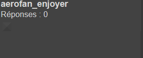
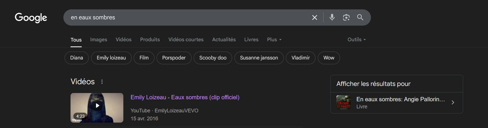
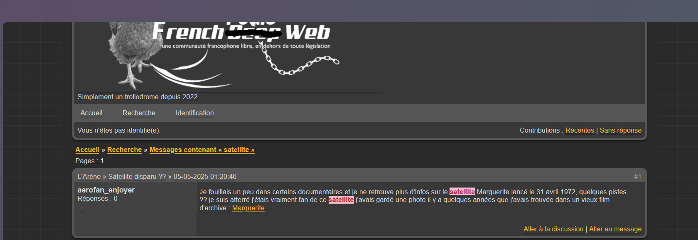

#  En eaux sombres
insane
Auteur : Sherpearce

Un fan d'aérospatiale assez étrange a posté un message sur un forum français à nom d'oiseau (littéralement). Nos équipes sont parvenues à obtenir une capture d'écran du forum sur laquelle on peut y voir son pseudonyme.

Quel satellite artificiel cherche-t-il ? Quand et de quelle ville a-t-il été lancé ?

Format du flag : 404CTF{satellite_kourou_31-12-2025}

N.B : Aucun compte n'est nécessaire pour accéder au contenu du message posté sur le forum. Le forum en question est actif.

---
# Solution 

Ce challenge est probablement celui qui m'a pris le plus de temps. 
On ne dispose que de ce screenshot : 

- En utilisant google dorcking (probablement la mauvaise orthographe) : "aerofan_enjoyer", **rien**
- En utilisant WhatsMyName, **rien**
- En utilisant de la recherche sur tous les forums à nom d'oiseau, **rien** 
_Dédicace à certains sites très colorés :_ 
  - https://passion-volatiles.forumactif.com/search?search_keywords=aerofan_enjoyer&typerecherche=interne&show_results=topics
  - https://lepetitoiseau.forumactif.com/
  
Bref, **rien**

Je laisse reposer et je me dis, tiens si je tapais le nom du challenge sur internet : 

Et là, tout est évident : **toujours rien**

=> Bref je me dis que ce n'est pas trouvable, et là, sombre, pas trouvable ? 
Donc j'ouvre Tor, hidden wiki et hop le Forum **Poule French Web**

je trouve notre utilisateur : 

En cliquant sur le lien on trouve le site de lancement : hammaguir. 

Ainsi le flag est : `404CTF{marguerite_hammaguir_31_04_1972}`

