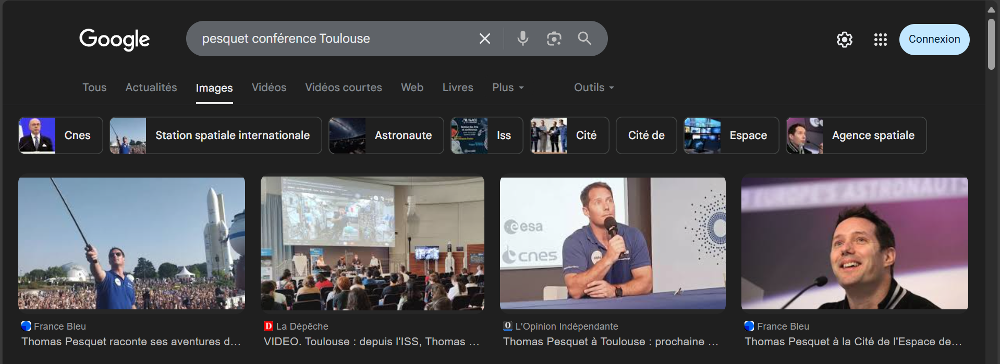
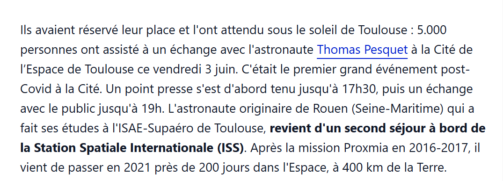

# La ville en rose
medium
Auteur : Sherpearce

Je suis allé voir Thomas Pesquet il y a quelques années de cela lors d'un événement concernant l'espace. Tout ce dont je me souviens c'est qu'il faisait tellement chaud qu'il portait ses lunettes de soleil de star 😎.

Ah et il a pris un selfie avec le public à l'aide d'une perche à selfie ! Mais quel jour et à quelle heure ?

Format du flag : 404CTF{01_06_2025_13h37}

La réponse est acceptée à 30 minutes près.
---

Tout d'abord le titre du challenge nous aide beaucoup car on sait que Toulouse est surnommée : La ville Rose. 

Donc en cherchant : `Pesquet conférence Toulouse`

On trouve la photo qui correspond bien à toutes les descriptions. 

En cliquant sur l'article on tombe sur : 

Ainsi l'échange a terminé à 19h donc j'ai tenté 18h45 dans le doute, avec une plage de 30 mn cela permet de balayer avant et après 19h. 

Le flag était : 404CTF{03_06_2022_18h45}