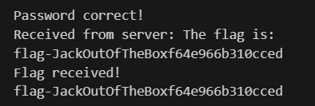

# Challenge

## Enoncé 

```
Description (français)

Les mots de passe de l'équipe se sont retrouvé dans une boite suprise 🤡📦! Vous avez les plans 🗺️📏, seriez-vous retrouvé les mots de passes?
Description (english)

The team passwords were lost in a Jack-in-the-Box 🤡📦! You have the plans 🗺️📏, will you be able to retrieve the passwords?
Connexion nc c.unitedctf.ca 10002 
```

On dispose également du fichier de configuration du serveur : 

```
package main

import (
	"crypto/md5"
	"encoding/hex"
	"encoding/json"
	"fmt"
	"log"
	"net"
	"os"
	"strconv"
)

var TEXT = map[string]map[string]string{
	"en": {
		"welcome":  "Welcome to Hash & Funambules 2! You can choose your language: en, fr\n",
		"hash":     "Here is the hash #",
		"password": ". Send me the password.\n",
		"wrong":    "Wrong password.\n",
		"success":  "Success!\n",
		"flag":     "The flag is: ",
	},
	"fr": {
		"welcome":  "Bienvue à Hash & Funambules 2! Vous pouvez choisir votre langue: en, fr\n",
		"hash":     "Voici le hash #",
		"password": ". Envoyez-moi le mot de passe.\n",
		"wrong":    "Mauvais mot de passe.\n",
		"success":  "Correct!\n",
		"flag":     "Le flag est: ",
	},
}

type Config struct {
	FLAG string `json:"FLAG"`
}

func chooseLanguage(conn net.Conn) (string, error) {
	buffer := make([]byte, 1024)

	conn.Write([]byte(TEXT["en"]["welcome"] + TEXT["fr"]["welcome"]))

	n, err := conn.Read(buffer)
	if err != nil {
		log.Println("Error reading:", err.Error())
		return "", err
	}

	switch string(buffer[:n-1]) {
	case "en":
		return "en", nil
	case "fr":
		return "fr", nil
	default:
		conn.Write([]byte("Invalid language"))
		return "", fmt.Errorf("invalid language")
	}
}

func listen(flag string) {
	listener, err := net.Listen("tcp", ":5000")
	if err != nil {
		log.Println("Error listening:", err.Error())
		return
	}
	defer listener.Close()
	log.Println("Server is listening on port 5000")

	for {
		// Wait for a connection
		conn, err := listener.Accept()
		if err != nil {
			log.Println("Error accepting connection:", err.Error())
			return
		}

		// Handle the connection in a new goroutine
		go handleConnection(conn, flag)
	}
}

func md5_hash(data []byte) string {
	hasher := md5.New()
	hasher.Write(data)
	return hex.EncodeToString(hasher.Sum(nil))
}

func handleConnection(conn net.Conn, flag string) {
	defer conn.Close()
	log.Println("Accepted new connection")
  fileReader, err := NewFileReader("rockyou.txt")
  if err != nil {
    return
  }

	lang, err := chooseLanguage(conn)
	if err != nil {
		return
	}

	for i := 0; i < 1000; i++ {
		// Echo back received data
		buffer := make([]byte, 1024)

    password, err := fileReader.RandomLine()
    if err != nil {
      log.Println("Error generating random number:", err.Error())
      return
    }

		hash := md5_hash([]byte(password))
		conn.Write([]byte(TEXT[lang]["hash"] + strconv.Itoa(i) + " : " + hash + TEXT[lang]["password"]))

		// Read data from the connection
		n, err := conn.Read(buffer)
		if err != nil {
			log.Println("Error reading:", err.Error())
			return
		}

		log.Println("Received: ", string(buffer[:n-1]))

		// Check if the password is correct
		if string(buffer[:n-1]) != password {
			conn.Write([]byte(TEXT[lang]["wrong"]))
			return
		} else {
			conn.Write([]byte(TEXT[lang]["success"]))
		}
	}
	conn.Write([]byte(TEXT[lang]["flag"] + flag))
	return
}

func LoadConfiguration(file string) Config {
	var config Config
	configFile, err := os.Open(file)
	defer configFile.Close()
	if err != nil {
		log.Println(err.Error())
	}
	jsonParser := json.NewDecoder(configFile)
	jsonParser.Decode(&config)
	return config
}

func main() {
	// Load config
	config := LoadConfiguration("config.json")

	// Create a TCP listener on port 5000
	listen(config.FLAG)
}
```

## Résolution

Cette fois, on fait une attaque par dictionnaire pour être plus rapide en utilisant `rockyou.txt`, qu'il faut placer dans votre répertoire courant pour le challenge. 

```
import socket
import hashlib

def md5_hash(password):
    """Retourne le hash MD5 d'un mot de passe."""
    return hashlib.md5(password.encode()).hexdigest()

def connect_to_server():
    """Se connecte au serveur et retourne l'objet de connexion."""
    server_address = ('c.unitedctf.ca', 10002)
    sock = socket.socket(socket.AF_INET, socket.SOCK_STREAM)
    sock.connect(server_address)
    return sock

def choose_language(sock):
    """Choisit la langue du serveur en envoyant 'en'."""
    language_choice = b'en\n'
    sock.sendall(language_choice)
    response = sock.recv(4096).decode('utf-8', errors='ignore')
    print("Server response after choosing language:", response)
    return response

def build_hash_dict(passwords):
    """Construit un dictionnaire de hachages MD5 pour une recherche rapide."""
    return {md5_hash(password): password for password in passwords}

def process_server_response(sock, hash_dict):
    """Traite les réponses du serveur."""
    while True:
        try:
            response = sock.recv(4096).decode('utf-8', errors='ignore')
            print("Received from server:", response)
            
            if 'Here is the hash #' in response:
                try:
                    parts = response.split(' : ')
                    if len(parts) < 2:
                        print("Unexpected format:", response)
                        continue

                    hash_md5 = parts[1].split('. Send me the password.')[0].strip()
                    print(f"Extracted hash: '{hash_md5}'")
                    
                    # Trouver le mot de passe en utilisant le dictionnaire
                    found_password = hash_dict.get(hash_md5)
                    
                    if found_password:
                        print(f"Found password: {found_password}")
                        message_to_send = f"{found_password}\n"
                        print(f"Sending to server: {message_to_send.strip()}")
                        
                        try:
                            sock.sendall(message_to_send.encode('utf-8'))
                        except UnicodeEncodeError as e:
                            print(f"Encoding error: {e}")
                            continue
                    else:
                        print("Password not found. Check your wordlist.")
                        
                except Exception as e:
                    print("Error processing response:", e)
                    
            elif 'Success!' in response:
                print("Password correct!")
            elif 'The flag is: ' in response:
                print("Flag received!")
                print(response.split('The flag is: ')[1].strip())
                break
            elif 'Wrong password.' in response:
                print("Wrong password. Trying next...")
            else:
                print("Unexpected response:", response)

        except socket.error as e:
            print(f"Socket error: {e}")
            break
        except Exception as e:
            print(f"Unexpected error: {e}")
            break

def main():
    with open('rockyou.txt', 'r', encoding='utf-8', errors='ignore') as f:
        passwords = [line.strip() for line in f]

    hash_dict = build_hash_dict(passwords)

    sock = connect_to_server()
    choose_language(sock)
    process_server_response(sock, hash_dict)
    sock.close()

if __name__ == "__main__":
    main()
```

