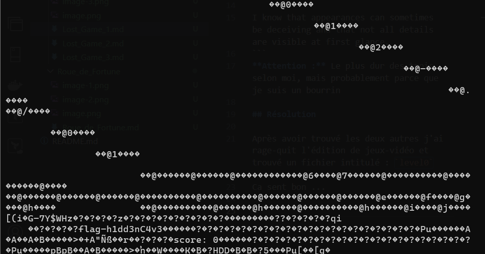

# Challenge

## Enoncé 

```
Description (français)

Il y a foule dans cette arcade ! Pourtant, en me promenant, je remarque ce jeu poussiéreux, sans personne autour. Je décide donc d'essayer d'y jouer !

Je sais que parfois les apparences peuvent être trompeuses, que ce ne sont pas tous les détails qui sont visibles au premier coup d'œil.
Description (english)

This arcade is crowded! Yet, as I walk around, I notice this dusty game with no one around it. So, I decide to give it a try!

I know that appearances can sometimes be deceiving and that not all details are visible at first glance.
```
**Attention :** Le plus dur des trois selon moi, mais probablement parce que je suis un bourrin

## Résolution

Après avoir trouvé les deux autres j'ai rage-quit l'édition de jeux-vidéo et trouvé un fichier intitulé : `level0`

Ca sent bon ... 



