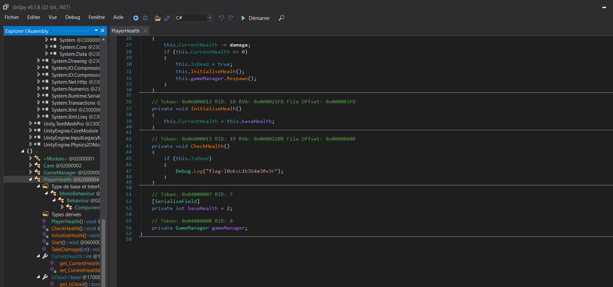

# Challenge

## Enoncé 

```
Description (français)

Il y a foule dans cette arcade ! Pourtant, en me promenant, je remarque ce jeu poussiéreux, sans personne autour. Je décide donc d'essayer d'y jouer !

Définitivement, il y a certains détails que seul l'équipe de développement peut voir.
Description (english)

This arcade is crowded! Yet, as I walk around, I notice this dusty game with no one around it. So, I decide to give it a try!

Definitely, there are certain details that only the development team can see.
```

## Résolution

J'ai simplement fouillé le code, principalement dans AssemblyCsharp.dll : 

