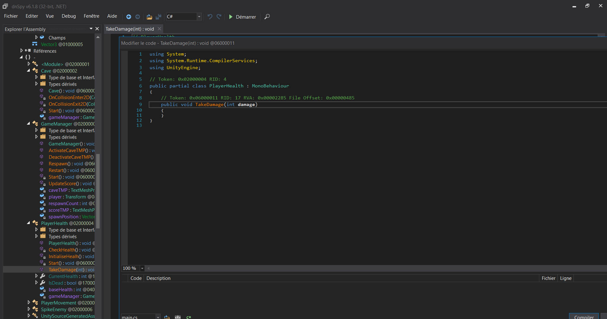
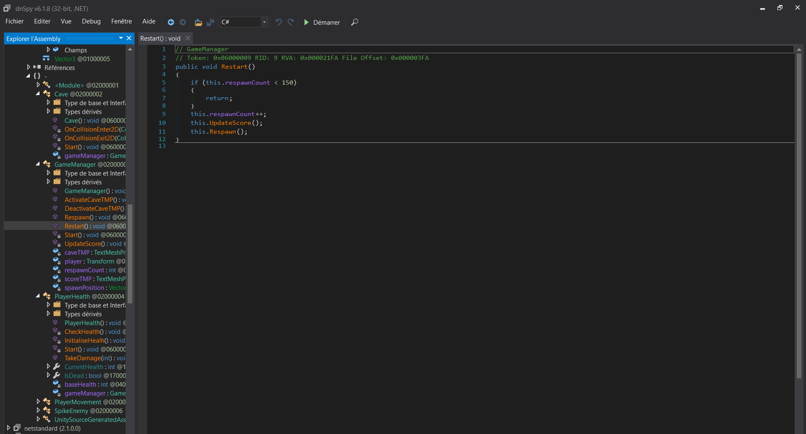

# Challenge

## Enoncé 

```
Description (français)

Il y a foule dans cette arcade ! Pourtant, en me promenant, je remarque ce jeu poussiéreux, sans personne autour. Je décide donc d'essayer d'y jouer !

MAIS COMMENT PEUT-ON TERMINER CE JEU ?
Description (english)

This arcade is crowded! Yet, as I walk around, I notice this dusty game with no one around it. So, I decide to give it a try!

BUT HOW CAN YOU FINISH THIS GAME?
```


## Résolution

Tout d'abord, on remarque qu'en faisant le parcours sans rien modifier au code, on ne pourra pas gagner ! 

Pour se faire, on peut déjà supprimer les dommages que l'on reçoit : 



Hop ! Maintenant que l'on est immortel, on peut finir le jeu ... 

... s'il est finissable !

En terminant le jeu, on retourne au début en incrémentant notre score de 1 ! 

Alors il doit probablement y avoir quelque chose à faire. Dans Game_manager, on apprend qu'il y a quelque chose qui se passe si on finit plus de 150 fois le jeu :

On pourrait alors faire plein de chose comme un code qui tourne pour faire le jeu 15 fois, augmenter la vitesse du perso, mais ... on peut aussi dire qu'il suffit d'avoir strictement moins que 150 points : 



Alors on dévoile une fin cachée : 


